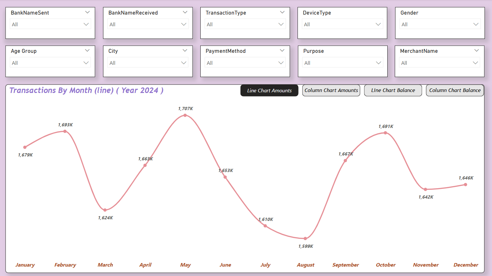
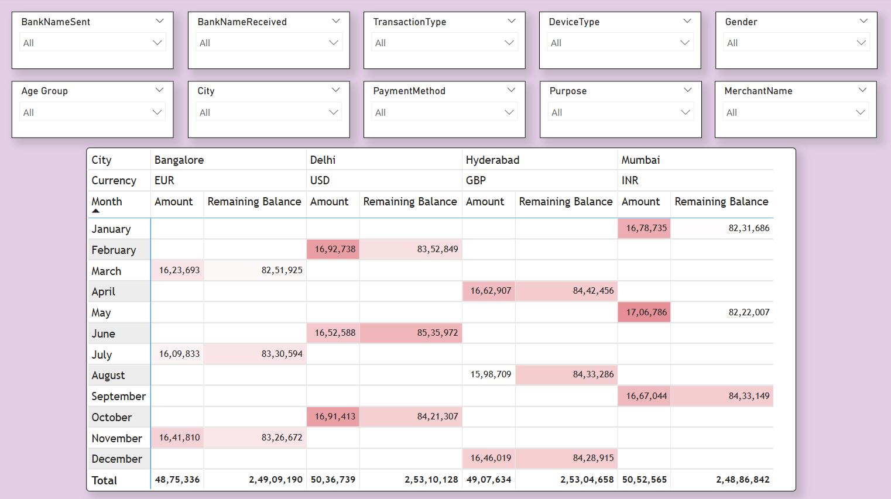
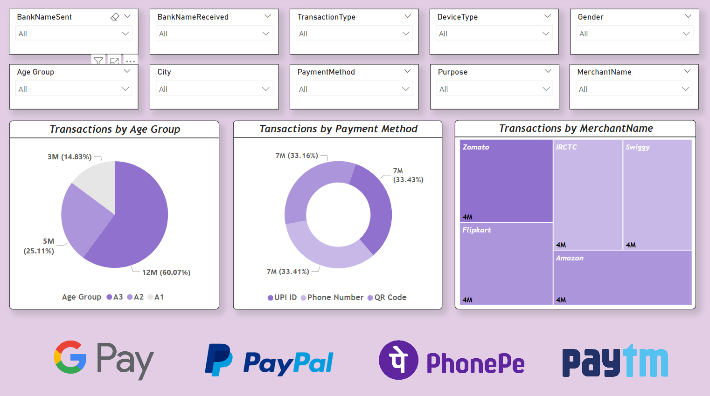

# UPI_Transactions_Analysis_PowerBI

## Project Objective  
The objective of this project is to analyze **UPI transactions** across different parameters, helping financial analysts and businesses gain insights into **user behavior, transaction trends, and payment patterns**. The interactive **Power BI dashboard** allows stakeholders to track and monitor **monthly transaction volumes, payment methods, and city-wise distributions** efficiently.  

---

## Process  
- ✅ **Created an interactive Power BI dashboard** to visualize UPI transactions with key financial metrics.  
- ✅ **Implemented slicers, bookmarks, and filters** for dynamic exploration and drill-down analysis.  
- ✅ **Used Power Query Editor** to transform the data to visualize.  
- ✅ **Designed various visualizations** such as **line charts, column charts, matrix views, pie charts** to enhance data interpretation.  

### **Dashboard Overview**

---

---

---

## Project Insights  
- 📌 **The highest transaction volume** is observed in certain months, with clear seasonal trends.  
- 📌 **Most transactions occur via Mobile devices**, followed by Tablets.  
- 📌 **Most transactions occur by age group which is greater than age 35**  
- 📌 **The most used payment method is UPI, with major transactions occurring through specific banks.**  
- 📌 **Cities like Mumbai, Delhi, and Bangalore have the highest UPI transaction frequencies.**  

---

## Final Conclusion  
The analysis provides valuable insights into **UPI transaction trends, user preferences, and payment behaviors**. Financial institutions and businesses can use this data to **optimize payment services, offer personalized discounts, and enhance digital payment adoption**. 
